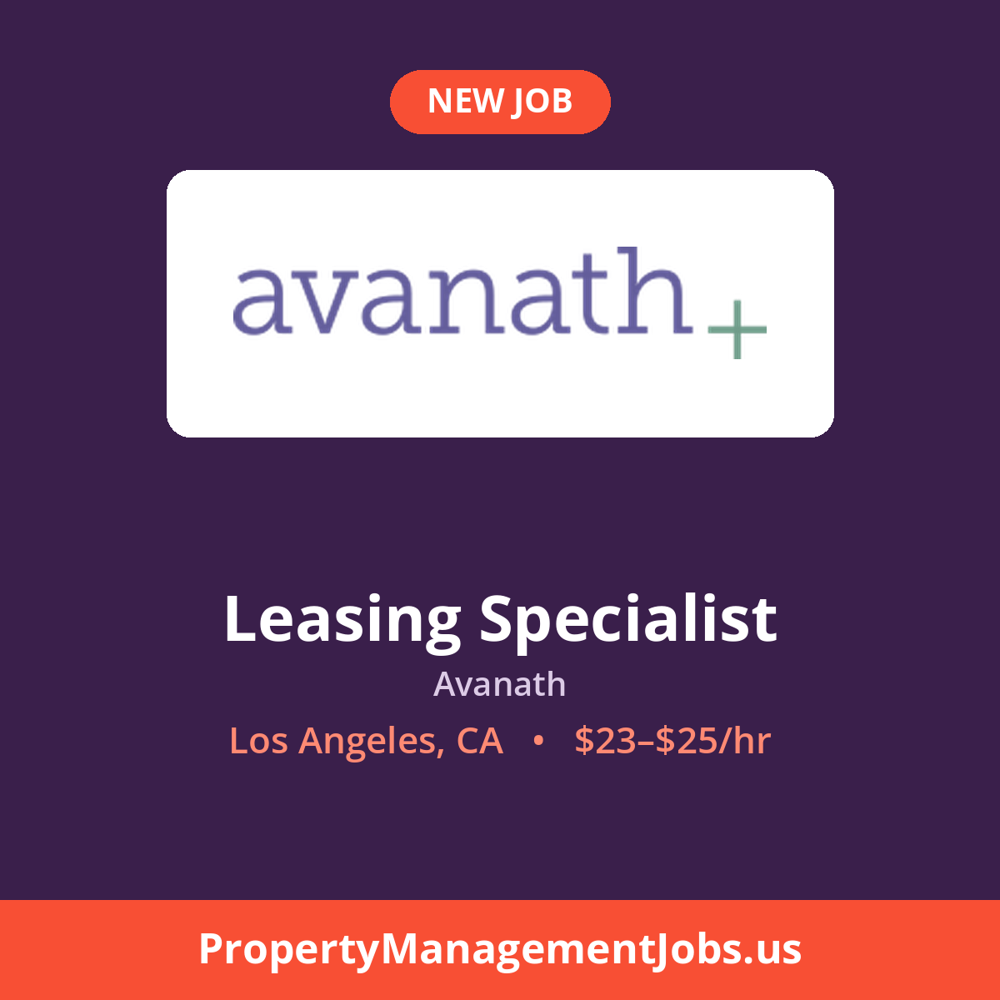
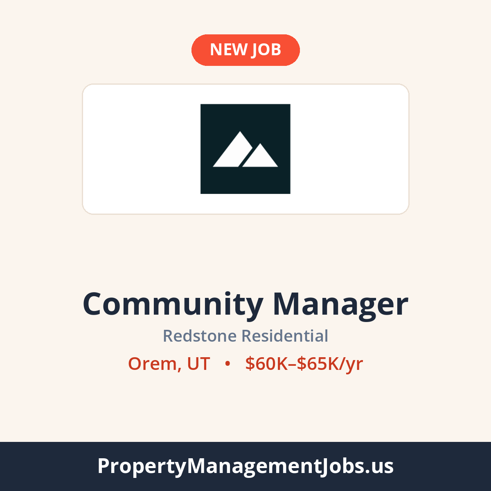

# LinkedIn posts

Written automatically by `.github/workflows/linkedin-post.yml` every Monday, Wednesday and Friday. Posting is currently **on** - posts are scheduled in Buffer. The switch is `LINKEDIN_POSTING_ENABLED` in that workflow.

Newest first.

---

### Community Manager at Investment Property Group

Scheduled Fri Oct 9, 2026 at 10:00 AM EDT · Loveland, CO · $26–$30/hr · [job page](https://propertymanagementjobs.us/jobs/community-manager-manufactured-housing-community-plus-housing-480224f5)  
Buffer: Scheduled on property-management-jobs-us · colours: slate · opening line: claude  
Why this job: 5 of 297 jobs in the feed qualified. Skipped: posted more than 4 days ago on the site 244, maintenance role 23, no salary 17, company posted recently 3, not live on the site 2, no city and state 1, already posted 1, pay at or below the LinkedIn floor 1.


```text
Alpine Vista Village, a 123-home manufactured housing community, needs a Community Manager for rent collection, lease enforcement, vendor coordination and a small on-site team. On-site residency is required, with a 2-bed, 2-bath home provided.

📍 Loveland, CO
💰 $26–$30/hr
🏢 Investment Property Group

See the full job and apply 👉 https://propertymanagementjobs.us/jobs/community-manager-manufactured-housing-community-plus-housing-480224f5?utm_source=linkedin&utm_medium=social&utm_campaign=job_post

#PropertyManagement #CommunityManager #NowHiring #LovelandJobs
```

---

### Leasing Specialist at Avanath

Scheduled Wed Oct 7, 2026 at 10:00 AM EDT · Los Angeles, CA · $23–$25/hr · [job page](https://propertymanagementjobs.us/jobs/leasing-specialist-6cdffb34)  
Buffer: Scheduled on property-management-jobs-us · colours: plum · opening line: claude  
Why this job: 6 of 292 jobs in the feed qualified. Skipped: posted more than 4 days ago on the site 259, maintenance role 12, no salary 8, not live on the site 5, company posted recently 1, no city and state 1.



```text
A leasing role in affordable housing, handling tours, applications and Yardi Voyager entry while supporting residents through renewals. LIHTC experience and bilingual English and Spanish skills are a strong plus.

📍 Los Angeles, CA
💰 $23–$25/hr
🏢 Avanath

See the full job and apply 👉 https://propertymanagementjobs.us/jobs/leasing-specialist-6cdffb34?utm_source=linkedin&utm_medium=social&utm_campaign=job_post

#PropertyManagement #LeasingJobs #NowHiring #LosAngelesJobs
```

---

### General Manager at AIR Communities

Scheduled Mon Oct 5, 2026 at 10:00 AM EDT · Alexandria, VA · $85K–$115K/yr · [job page](https://propertymanagementjobs.us/jobs/general-manager-foxchase-apartment-homes-e3566a15)  
Buffer: Scheduled on property-management-jobs-us · colours: teal · opening line: claude  
Why this job: 10 of 284 jobs in the feed qualified. Skipped: posted more than 4 days ago on the site 246, no salary 10, maintenance role 8, not live on the site 4, no city and state 3, pay at or below the LinkedIn floor 1, not a single English job posting 1, company posted recently 1.


```text
Foxchase Apartment Homes is looking for a General Manager to own site financials, leasing results and team development, working Tuesday through Saturday. A good fit for someone with two or more years leading on-site teams.

📍 Alexandria, VA
💰 $85K–$115K/yr
🏢 AIR Communities

See the full job and apply 👉 https://propertymanagementjobs.us/jobs/general-manager-foxchase-apartment-homes-e3566a15?utm_source=linkedin&utm_medium=social&utm_campaign=job_post

#PropertyManagement #PropertyManager #NowHiring #AlexandriaJobs
```

---

### Community Manager at Redstone Residential

Scheduled Fri Oct 2, 2026 at 10:00 AM EDT · Orem, UT · $60K–$65K/yr · [job page](https://propertymanagementjobs.us/jobs/community-manager-003fb9b2)  
Buffer: Scheduled on property-management-jobs-us · colours: cream · opening line: claude  
Why this job: 3 of 281 jobs in the feed qualified. Skipped: posted more than 4 days ago on the site 235, maintenance role 15, no salary 15, pay at or below the LinkedIn floor 5, no city and state 4, not live on the site 2, already posted 1, unsupported logo format .svg 1.



```text
A student housing site next to Utah Valley University is looking for a Community Manager with full P&L ownership, covering occupancy, delinquency, leasing and renewal strategy, and coaching the on-site team.

📍 Orem, UT
💰 $60K–$65K/yr
🏢 Redstone Residential

See the full job and apply 👉 https://propertymanagementjobs.us/jobs/community-manager-003fb9b2?utm_source=linkedin&utm_medium=social&utm_campaign=job_post

#PropertyManagement #CommunityManager #NowHiring #OremJobs
```

---

### Assistant Manager at Olympus Property

Scheduled Wed Sep 30, 2026 at 12:46 PM EDT · Phoenix, AZ · $25/hr · [job page](https://propertymanagementjobs.us/jobs/assistant-manager-the-tessera-9157f9aa)  
Buffer: Scheduled on property-management-jobs-us · colours: coral · opening line: claude  
Why this job: 2 of 282 jobs in the feed qualified. Skipped: posted more than 4 days ago on the site 257, no salary 10, maintenance role 7, pay at or below the LinkedIn floor 3, no city and state 2, not live on the site 1.


```text
An Assistant Manager role at the Tessera apartment community where the scope leans financial: rent collection, deposits, final account statements, and delinquency oversight, plus leasing floor support. RealPage and Knock experience is a real advantage.

📍 Phoenix, AZ
💰 $25/hr
🏢 Olympus Property

See the full job and apply 👉 https://propertymanagementjobs.us/jobs/assistant-manager-the-tessera-9157f9aa?utm_source=linkedin&utm_medium=social&utm_campaign=job_post

#PropertyManagement #AssistantPropertyManager #NowHiring #PhoenixJobs
```

---

### LIHTC Leasing Consultant at Cirrus Asset Management

Scheduled Mon Sep 28, 2026 at 10:00 AM EDT · Castle Rock, CO · $22–$24/hr · [job page](https://propertymanagementjobs.us/jobs/lihtc-leasing-consultant-30024-29ffb3e8)  
Buffer: Scheduled on property-management-jobs-us · colours: slate · opening line: claude  
Why this job: 6 of 272 jobs in the feed qualified. Skipped: posted more than 4 days ago on the site 239, maintenance role 9, no salary 7, not live on the site 6, no city and state 3, pay at or below the LinkedIn floor 2.


```text
630 units, a waitlist longer than the vacancies, and a full LIHTC certification cycle to own — the kind of compliance depth that leads to senior leasing and compliance coordinator roles.

📍 Castle Rock, CO
💰 $22–$24/hr
🏢 Cirrus Asset Management

See the full job and apply 👉 https://propertymanagementjobs.us/jobs/lihtc-leasing-consultant-30024-29ffb3e8?utm_source=linkedin&utm_medium=social&utm_campaign=job_post

#PropertyManagement #LeasingJobs #NowHiring #CastleRockJobs
```

---

### Community Administrative Coordinator at Action Property Management

Preview only - would post Mon Sep 28, 2026 at 10:00 AM EDT · San Francisco, CA · $29–$30/hr · [job page](https://propertymanagementjobs.us/jobs/community-administrative-coordinator-the-infinity-d20bb63e)  
Buffer: Connected - live posts would go to property-management-jobs-us · colours: cream · opening line: claude  
Why this job: 7 of 272 jobs in the feed qualified. Skipped: older than the posting window 213, maintenance role 21, no salary 15, not live on the site 6, no city and state 4, pay at or below the LinkedIn floor 3, already posted 2, company posted recently 1.


```text
Be the operational anchor at The Infinity, a luxury high-rise HOA, learning governance, vendors and hospitality-grade service up close: the fastest path coordinators take toward community manager.

📍 San Francisco, CA
💰 $29–$30/hr
🏢 Action Property Management

See the full job and apply 👉 https://propertymanagementjobs.us/jobs/community-administrative-coordinator-the-infinity-d20bb63e?utm_source=linkedin&utm_medium=social&utm_campaign=job_post

#PropertyManagement #RealEstateJobs #NowHiring #SanFranciscoJobs
```

---

### Concierge at Rise Association Management Group

Preview only - would post Sun Sep 27, 2026 at 9:57 PM EDT · Houston, TX · $15–$17/hr · [job page](https://propertymanagementjobs.us/jobs/concierge-f2c39551)  
Buffer: Connected - live posts would go to property-management-jobs-us · colours: coral · opening line: claude  
Why this job: 11 of 272 jobs in the feed qualified. Skipped: older than the posting window 213, maintenance role 20, no salary 12, not live on the site 10, no city and state 4, company posted recently 1, already posted 1.


```text
Overnight, you are the building: access control, camera monitoring, incident reports and packages, plus restaurant picks and transportation for River Oaks high-rise residents expecting 5-star service.

📍 Houston, TX
💰 $15–$17/hr
🏢 Rise Association Management Group

See the full job and apply 👉 https://propertymanagementjobs.us/jobs/concierge-f2c39551?utm_source=linkedin&utm_medium=social&utm_campaign=job_post

#PropertyManagement #CommunityManager #NowHiring #HoustonJobs
```

---

### Leasing Consultant at MG Properties

Preview only - would post Sun Sep 27, 2026 at 7:57 PM EDT · Denver, CO · $22–$24/hr · [job page](https://propertymanagementjobs.us/jobs/leasing-consultant-neon-local-3a449b03)  
Buffer: No Buffer API key saved yet · colours: slate · opening line: claude  
Why this job: 12 of 272 jobs in the feed qualified. Skipped: older than the posting window 213, maintenance role 20, no salary 13, not live on the site 10, no city and state 4.


```text
Own the full leasing cycle at Neon Local, from first tour to signed lease, at a company that promotes from within and moves strong leasing consultants into Assistant Manager roles.

📍 Denver, CO
💰 $22–$24/hr
🏢 MG Properties

See the full job and apply 👉 https://propertymanagementjobs.us/jobs/leasing-consultant-neon-local-3a449b03?utm_source=linkedin&utm_medium=social&utm_campaign=job_post

#PropertyManagement #LeasingJobs #NowHiring #DenverJobs
```

