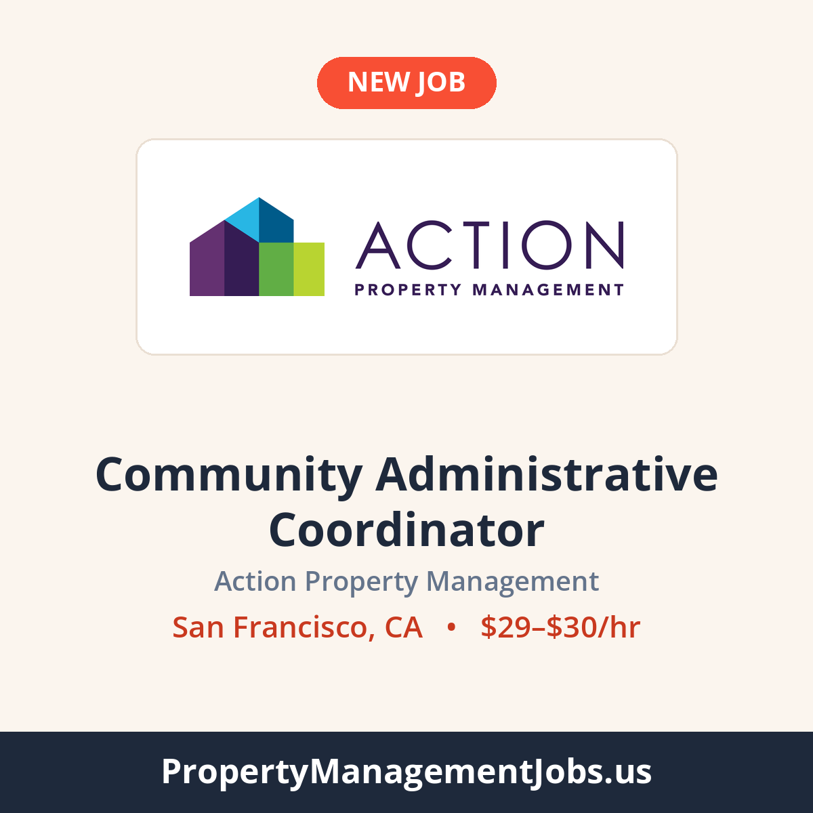

# LinkedIn posts

Written automatically by `.github/workflows/linkedin-post.yml` every Monday, Wednesday and Friday. Posting is currently **off (preview mode)** - nothing is sent to Buffer or LinkedIn. The switch is `LINKEDIN_POSTING_ENABLED` in that workflow.

Newest first.

---

### Community Administrative Coordinator at Action Property Management

Preview only - would post Mon Sep 28, 2026 at 10:00 AM EDT · San Francisco, CA · $29–$30/hr · [job page](https://propertymanagementjobs.us/jobs/community-administrative-coordinator-the-infinity-d20bb63e)  
Buffer: Connected - live posts would go to property-management-jobs-us · colours: cream · opening line: claude  
Why this job: 7 of 272 jobs in the feed qualified. Skipped: older than the posting window 213, maintenance role 21, no salary 15, not live on the site 6, no city and state 4, pay at or below the LinkedIn floor 3, already posted 2, company posted recently 1.



```text
Be the operational anchor at The Infinity, a luxury high-rise HOA, learning governance, vendors and hospitality-grade service up close: the fastest path coordinators take toward community manager.

📍 San Francisco, CA
💰 $29–$30/hr
🏢 Action Property Management

See the full job and apply 👉 https://propertymanagementjobs.us/jobs/community-administrative-coordinator-the-infinity-d20bb63e?utm_source=linkedin&utm_medium=social&utm_campaign=job_post

#PropertyManagement #RealEstateJobs #NowHiring #SanFranciscoJobs
```

---

### Concierge at Rise Association Management Group

Preview only - would post Sun Sep 27, 2026 at 9:57 PM EDT · Houston, TX · $15–$17/hr · [job page](https://propertymanagementjobs.us/jobs/concierge-f2c39551)  
Buffer: Connected - live posts would go to property-management-jobs-us · colours: coral · opening line: claude  
Why this job: 11 of 272 jobs in the feed qualified. Skipped: older than the posting window 213, maintenance role 20, no salary 12, not live on the site 10, no city and state 4, company posted recently 1, already posted 1.


```text
Overnight, you are the building: access control, camera monitoring, incident reports and packages, plus restaurant picks and transportation for River Oaks high-rise residents expecting 5-star service.

📍 Houston, TX
💰 $15–$17/hr
🏢 Rise Association Management Group

See the full job and apply 👉 https://propertymanagementjobs.us/jobs/concierge-f2c39551?utm_source=linkedin&utm_medium=social&utm_campaign=job_post

#PropertyManagement #CommunityManager #NowHiring #HoustonJobs
```

---

### Leasing Consultant at MG Properties

Preview only - would post Sun Sep 27, 2026 at 7:57 PM EDT · Denver, CO · $22–$24/hr · [job page](https://propertymanagementjobs.us/jobs/leasing-consultant-neon-local-3a449b03)  
Buffer: No Buffer API key saved yet · colours: slate · opening line: claude  
Why this job: 12 of 272 jobs in the feed qualified. Skipped: older than the posting window 213, maintenance role 20, no salary 13, not live on the site 10, no city and state 4.


```text
Own the full leasing cycle at Neon Local, from first tour to signed lease, at a company that promotes from within and moves strong leasing consultants into Assistant Manager roles.

📍 Denver, CO
💰 $22–$24/hr
🏢 MG Properties

See the full job and apply 👉 https://propertymanagementjobs.us/jobs/leasing-consultant-neon-local-3a449b03?utm_source=linkedin&utm_medium=social&utm_campaign=job_post

#PropertyManagement #LeasingJobs #NowHiring #DenverJobs
```

